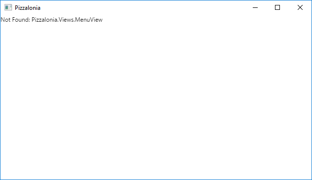
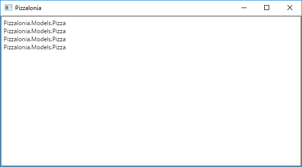
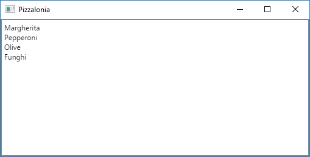
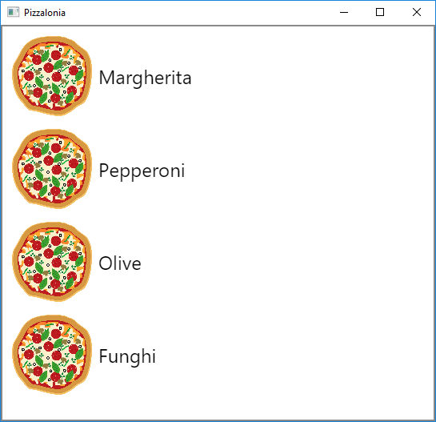

# Creating The Application

## Creating the Models

For this sample application we're not going to use a real database, we're just going to simulate a database by building some data structures in memory.

First we'll add a `Models` directory to our solution to hold the models and then we can define the types of crust using an `enum` in the `Models\Crust.cs` file:

```csharp
namespace Pizzalonia.Models
{
    public enum Crust
    {
        Thin,
        Thick,
    }
}
```

Next we'll define a model for toppings in the `Models\Topping.cs` file. A topping for now will just have a name and a price:

```csharp
namespace Pizzalonia.Models
{
    public class Topping
    {
        public Topping(string name, decimal price)
        {
            Name = name;
            Price = price;
        }

        public string Name { get; }
        public decimal Price { get; }
    }
}
```

Next comes the model for a pizza itself in `Models\Pizza.cs`:

```csharp
using System.Collections.Generic;
using System.Linq;

namespace Pizzalonia.Models
{
    public class Pizza
    {
        public Pizza(string name, Crust crust, IEnumerable<Topping> toppings)
        {
            Name = name;
            Crust = Crust;
            Toppings = toppings.ToList();
        }

        public string Name { get; }
        public Crust Crust { get; }
        public IList<Topping> Toppings { get; }
    }
}
```

Finally lets define the database itself with our menu in `Models\Database.cs`:

```csharp
using System.Collections.Generic;

namespace Pizzalonia.Models
{
    public class Database
    {
        public IList<Pizza> Menu =
            new[]
            {
                new Pizza("Margherita", Crust.Thin,
                    new[]
                    {
                        new Topping("Tomato", 0.5m),
                        new Topping("Mozzarella", 0.5m),
                    }),
                new Pizza("Pepperoni", Crust.Thin,
                    new[]
                    {
                        new Topping("Tomato", 0.5m),
                        new Topping("Mozzarella", 0.5m),
                        new Topping("Pepperoni", 1.0m),
                    }),
                new Pizza("Olive", Crust.Thin,
                    new[]
                    {
                        new Topping("Tomato", 0.5m),
                        new Topping("Mozzarella", 0.5m),
                        new Topping("Olives", 0.5m),
                    }),
                new Pizza("Funghi", Crust.Thin,
                    new[]
                    {
                        new Topping("Tomato", 0.5m),
                        new Topping("Mozzarella", 0.5m),
                        new Topping("Mushrooms", 0.5m),
                    }),
            };
    }
}
```

## Creating the Menu View Model

Now we can get started with building our application! The first thing we want to do is display the pizza menu to the user. This will look something like this:

> TODO: Image here

Lets get started by building a view model for the menu. At first the view model will have just a simple list of pizzas read from the database. Create a new file in the `ViewModels` directory called `MenuViewModel`:

```csharp
using System.Collections.Generic;
using Pizzalonia.Models;

namespace Pizzalonia.ViewModels
{
    public class MenuViewModel : ViewModelBase
    {
        public MenuViewModel(Database database)
        {
            Items = database.Menu;
        }

        public IList<Pizza> Items { get; }
    }
}
```

Here we're passing a `Database` instance into the view model and simply assigning the menu from the database to an `Items` property. At this point, it may not be clear why we need a view model just to do this, but that will become clear later.

Next thing to do is expose the menu in the window. You'll see that when your application was created, a `MainWindowViewModel` was automatically added to the project. This should currently have the following content:

```csharp
using System;
using System.Collections.Generic;
using System.Text;

namespace Pizzalonia.ViewModels
{
    public class MainWindowViewModel : ViewModelBase
    {
        public string Greeting => "Hello World!";
    }
}
```

Lets delete the `Greeting` property and replace it with a `CurrentPage` property which will track the page currently being shown in the window. Then we'll create a `MenuViewModel` and assign it to the `CurrentPage` property:

```csharp
using Pizzalonia.Models;
using ReactiveUI;

namespace Pizzalonia.ViewModels
{
    public class MainWindowViewModel : ViewModelBase
    {
        readonly Database database;
        ViewModelBase currentPage;

        public MainWindowViewModel()
        {
            database = new Database();
            currentPage = new MenuViewModel(database);
        }

        public ViewModelBase CurrentPage
        {
            get { return currentPage; }
            private set { this.RaiseAndSetIfChanged(ref currentPage, value); }
        }
    }
}
```

> You might notice that the implementation for `CurrentPage` looks a little strange. This is because we're using ReactiveUI here to raise property change notifications for the property. You can read more about this [in the ReactiveUI docs](https://reactiveui.net/docs) but essentially by using this pattern Avalonia can listen for changes on view model properties and automatically update the view.

Now open the `MainWindow.xaml` file: this is the view for the main window. Change it to look like this:

```csharp
<Window xmlns="https://github.com/avaloniaui"
        xmlns:x="http://schemas.microsoft.com/winfx/2006/xaml"
        Title="Pizzalonia"
        Content="{Binding CurrentPage}">
</Window>
```

Here we're taking the `Window.Content` property and binding it to the `CurrentPage` property that we just added to the Window's view model. You'll remember that we set the default value of the `CurrentPage` property to an instance of `MenuViewModel`, and if you run the application now you should see:



Quite rightly, we're being told that we haven't created the view for the menu yet, so let's do that now.

## Creating the Menu View

Create a new view called `MenuView` in the `Views` directory:

- In Visual Studio, right click on the `Views` folder and select `Add -> New Item`. Navigate to the Avalonia category, select "UserControl" then enter "MenuView" as the name.
- In .NET core using the command line run `dotnet new avalonia.usercontrol -o Views -n MenuView --namespace Pizzalonia.Views` from the directory containing the `Pizzalonia.csproj` file.

Open up the `Views\MenuView.xaml` file and edit it to look like this:

```xml
<UserControl xmlns="https://github.com/avaloniaui"
             xmlns:x="http://schemas.microsoft.com/winfx/2006/xaml">
  <ListBox Items="{Binding Items}"/>
</UserControl>
```

Running the application now will show the following:



Progress! We now just need to tell the `ListBox` we just added how to display the pizzas that it's displaying. To do this we'll add an `ItemTemplate`.

> You might be wondering at this point why a message similar to the earlier "Not Found: Pizzalonia.Views.MenuView" message isn't being shown. This is because `Pizza` here is a _model_, not a view model and views are only automatically looked-up for classes deriving from the `ViewModelBase` class.

An `ItemTemplate` can be thought of as a template that is "stamped out" for each item displayed in a `ListBox`. First of all, lets just display the name of the pizza - change the `<ListBox>` element to look like this:

```xml
  <ListBox Items="{Binding Items}">
    <ListBox.ItemTemplate>
      <DataTemplate>
        <TextBlock Text="{Binding Name}"/>
      </DataTemplate>
    </ListBox.ItemTemplate>
  </ListBox>
```

Here we're assigning a `DataTemplate` to the `ListBox`'s `ItemTemplate` property. The  `DataTemplate` contains a single `TextBlock` control whose `Text` property is bound to the `Name` property on each item. Running the program now shows us that the name of each pizza is displayed:



## Making the Menu look a bit nicer

Now we've got the basic list of pizzas displaying, lets make it look a bit nicer. First lets add a pizza image to each time. Download the pizza image from [here](todo) and drop it into the Assets directory.

Now lets display the pizza image next to the name of each pizza and make the text a little bigger:

```xml
  <ListBox Items="{Binding Items}">
    <ListBox.ItemTemplate>
      <DataTemplate>
        <DockPanel>
          <Image DockPanel.Dock="Left" Source="resm:Pizzalonia.Assets.pizza.png" Margin="8"/>
          <TextBlock FontSize="24" VerticalAlignment="Center" Text="{Binding Name}"/>
        </DockPanel>
      </DataTemplate>
    </ListBox.ItemTemplate>
  </ListBox>
```

Here's what's happening here:

- We added a `DockPanel` as the top-level control in the data template. A data template can contain only a single root control so we need something to hold the two child controls.
- We added an `Image` control, docked it left, pointed it to the pizza image we just added and placed a margin around it to separate it from the name of the pizza
- We set the `TextBlock`'s `FontSize` to 24 to make the text bigger and then set the `VerticalAlignment` property to align the text vertically.

> If you're used to WPF or UWP you might think the `"resm:Pizzalonia.Assets.pizza.png"` string for specifying the image looks a little strange and you'd be right. Unfortunately the only resource format that is currently cross-platform is the "Manifest Resource" format (`resm`) ; files in the Assets directory will automatically be included as manifest resources. To calculate the URL for an asset simply replace the directory separators with `.` characters and prepend the name of the project.

Running the application will now give us:


